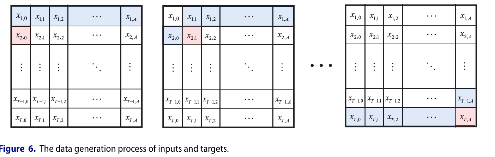
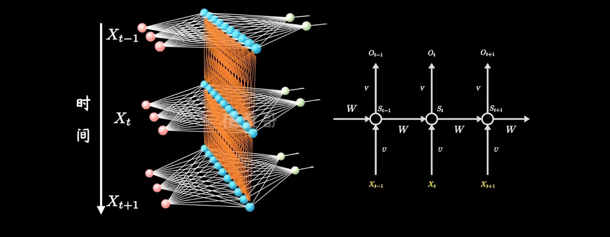
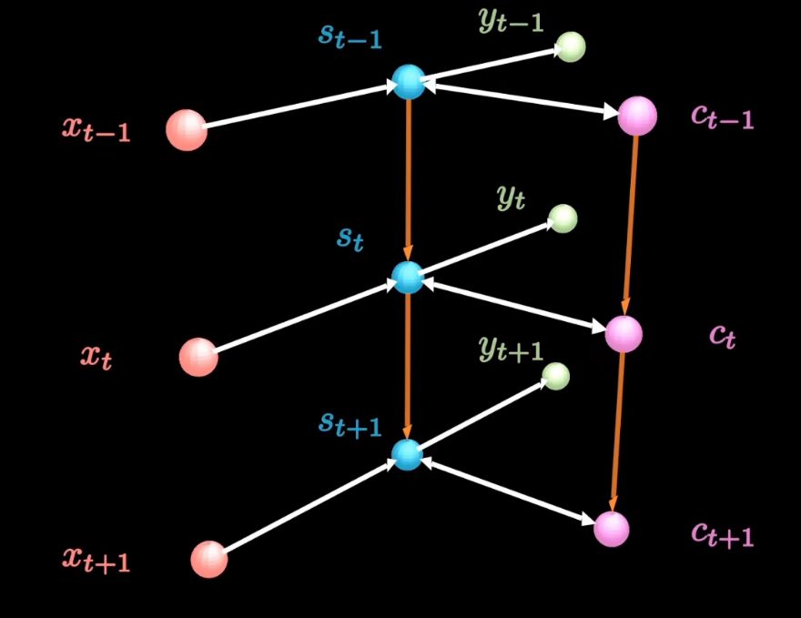
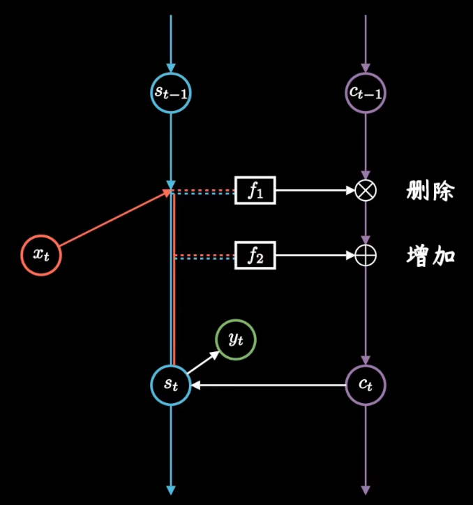
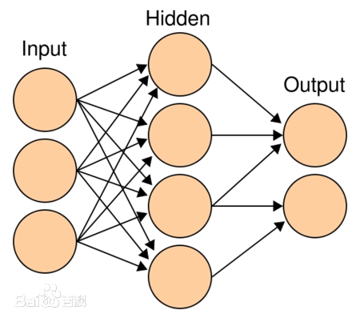
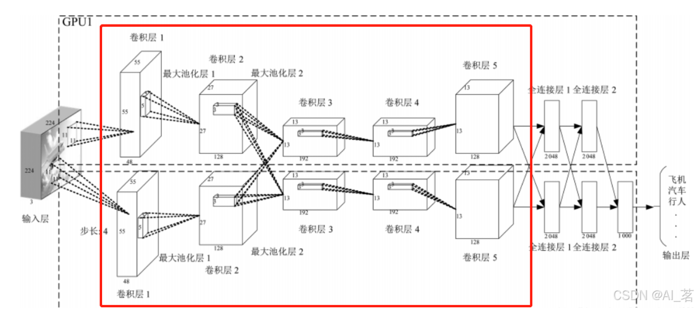
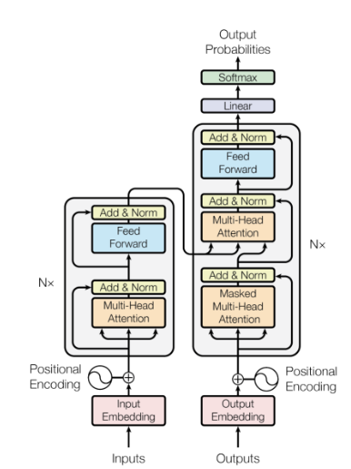

```{r setup, include=FALSE,message=FALSE}
knitr::opts_chunk$set(echo = TRUE,message = FALSE
                      )

library(knitr)
library(data.table)

# 一些必要设置
library(keras)
library(tensorflow)
library(reticulate)
use_python("D:/code/anaconda3/envs/r-tensorflow/python.exe", required = TRUE)

# --- 随机 ---
set.seed(412)
Sys.setenv(PYTHONHASHSEED = "0",
           TF_DETERMINISTIC_OPS = "1",
           TF_CUDNN_DETERMINISTIC = "1")

np <- import("numpy", convert = FALSE); np$random$seed(42L)
import("random", convert = FALSE)$seed(42L)
tf$random$set_seed(42L)
tf$config$experimental$enable_op_determinism()

```


# 一、画图展示数据

```{r}
library(readxl) 
library(dplyr)  
library(tidyr)  
library(plotly) 
library(forecast)
library(purrr)

uk = read_excel("data.xlsx", sheet = "UK") |> 
  mutate(log_mx = log(mx))
france = read_excel("data.xlsx", sheet = "France")|> 
  mutate(log_mx = log(mx))
spain = read_excel("data.xlsx", sheet = "Spain")|> 
  mutate(log_mx = log(mx))
canada = read_excel("data.xlsx", sheet = "Canada")|> 
  mutate(log_mx = log(mx))
japan = read_excel("data.xlsx", sheet = "Japan")|> 
  mutate(log_mx = log(mx))
finland = read_excel("data.xlsx", sheet = "Finland")|> 
  mutate(log_mx = log(mx))
denmark = read_excel("data.xlsx", sheet = "Denmark")|> 
  mutate(log_mx = log(mx))
italy = read_excel("data.xlsx", sheet = "Italy")|> 
  mutate(log_mx = log(mx))

uk_wide <- uk |>
  select(Year, Age, log_mx) |>
  pivot_wider(names_from = Age, values_from = log_mx) |>
  arrange(Year)

z_mat <- as.matrix(uk_wide[ , -1])        # 去掉 Year 列后转矩阵
x_age <- sort(unique(uk$Age))         # Age 轴
y_year <- uk_wide$Year                    # Year 轴

# 
fig <- plot_ly(
  x = x_age,  y = y_year,  z = z_mat,
  type = "surface",
  colorscale = "Rainbow",              # 彩虹配色
  showscale = TRUE                     # 右侧色标
) |>
layout(
  scene = list(
    xaxis = list(title = "Age"),
    yaxis = list(title = "Year"),
    zaxis = list(title = "log(Mortality)"),
    camera = list(eye = list(x = 1.6, y = -1.6, z = 0.8))  
  )
)

fig
```

```{r}
ggplot(uk, aes(x = Year, y = log_mx, group = Age, colour = Age)) +
  geom_line(linewidth  = .3) +                       
  scale_colour_gradientn(                       
    colours = rev(rainbow(11)),                
    limits  = c(0, 100),
    name    = "Age"
  ) +
  scale_x_continuous(breaks = seq(1950, 2020, 10)) +
  labs(x = "Year", y = "log(Mortality)") +
  theme_bw(base_size = 13) +
  theme(
    panel.grid.major  = element_line(colour = "grey85", linewidth  = .3),
    panel.grid.minor  = element_line(colour = "grey90", linewidth  = .2),
    legend.position   = "right"
  )
```


# 二、Lee-Cart模型
## 1. 原始模型介绍
Lee-Carter模型的基本形式如下：
$$\log(m_{x,t}) = \alpha_x + \beta_x \cdot k_t + \epsilon_{x,t}$$
其中：

- $m_{x,t}$ 是年龄为 x 的人在时间 t 的死亡率。
- $\alpha_x$ 是与年龄 x 相关的常数，代表基础死亡率，是x随时间变化的死亡率的均值，通过对历史数据的回归分析来确定
- $\beta_x$ 是年龄 x 的灵敏度，表示该年龄组死亡率对 $k_t$变化的敏感度，通过对历史数据的回归分析来确定
- $k_t$ 是时间效应，代表死亡率的时间趋势，是一个单变量时间序列向量，通过时间序列分析来估计
- $\epsilon_{x,t}$ 是误差项，表示模型拟合中的随机误差。

## 2. 模型求解
主要方法是SVD
1.  数据矩阵的构建

- 构建一个矩阵$\mathbf{M}$，其中每一行对应一个年龄组x，每一列对应一个时间点 t，矩阵元素为$\ln(m(x,t))$
- 对矩阵  $\mathbf{M}$进行中心化处理，即对每个年龄组 x，减去其时间平均值：
$$\mathbf{M}_{\text{centered}} = \mathbf{M} - \mathbf{A}$$
A的每一行是 $a_x = \frac{1}{T} \sum_t\ln(m(x,t))$，即每个年龄组的对数死亡率的平均值。  

2.  奇异值分解
对中心化后的矩阵进行奇异值分解：
$$\mathbf{M}_{\text{centered}} = \mathbf{U} \mathbf{\Sigma} \mathbf{V}^T$$
其中：

- $\mathbf{U}$ 是左奇异向量矩阵，是列向量张成空间，表示年龄组对时间的响应；
- $\mathbf{\Sigma}$是奇异值矩阵，表示每个模式的权重；
- $\mathbf{V}$ 是右奇异向量矩阵，是行向量张成空间，表示年龄组之间模式。  

3. 提取主要成分

- 取第一个奇异值对应的左奇异向量 $\mathbf{U}_1$ 和右奇异向量 $\mathbf{V}_1$ ，以及第一个奇异值 $\sigma_1$
- 通过以下关系式得到 估计：
$$
b_x = \mathbf{U}_1(x), \quad k(t) = \sigma_1 \mathbf{V}_1(t)$$
- $a_x$已经通过对数死亡率的平均值得到。
4.  归一化
为了消除参数的不确定性(b,k和bc,k/c都是估计，结果相同，但估计量有变化），因此进行了归一化处理：
- 令  $\sum_x b_x = 1$
- 令  $\sum_t k(t) = 0$
 
简单推导后得到$$\log(m_{x,t}) = \alpha_x + \beta_x\cdot  \bar{k} + \frac{\beta_x}{\bar{\beta}} \cdot (k_t - \bar{k}) \cdot \bar{\beta} + \epsilon_{x,t}$$

```{r}
# 年龄、年份向量
ages  <- sort(unique(uk$Age))
years <- sort(unique(uk$Year))


leecart = function(data){
  # 划分训练 / 测试集
train_years <- 1950:2000
test_years  <- 2001:2019

train <- filter(data, Year %in% train_years)
test  <- filter(data, Year %in% test_years)


# 转换成矩阵
logmx_mat <- train %>%
  select(Year, Age, log_mx) %>%
  pivot_wider(names_from = Year, values_from = log_mx) %>%
  arrange(Age)

logmx_mat <- as.matrix(logmx_mat[ , -1])      # 去掉 Age 列

#计算 ax 
ax <- rowMeans(logmx_mat)

# 中心化并做 SVD 
centered <- sweep(logmx_mat, 1, ax, "-")      # 每行减自身均值
svd_res  <- svd(centered)

bx <- svd_res$u[ , 1]* svd_res$d[1] 
kt <- svd_res$v[, 1]

c1 <- mean(kt)
c2 <- sum(bx)
ax <- ax + c1 * bx
bx <- bx / c2
kt <- (kt - c1) * c2

names(kt) <- train_years

kt_ts   <- ts(kt, start = min(train_years))# 转为时间序列
kt_fit  <- auto.arima(kt_ts,
                      stepwise = FALSE, approximation = FALSE)#后来细看都是ARIMA(2,0,0)(0,1,1)[0]模型
kt_fore <- forecast(kt_fit, h = length(test_years))$mean
names(kt_fore) <- test_years

# κ_t 拼接历史+预测 -
kt_all <- c(kt, kt_fore)          # 长度 = 1950–2019

# 复原 log(mx) 
# 结果：行=Age，列=所有年份
logmx_hat <- outer(bx, kt_all) + ax

logmx_hat = cbind(logmx_hat,data.frame(Age = 0:100))
mx_hat = logmx_hat |> 
  pivot_longer(-Age,names_to = "Year",values_to = "log_mx", names_transform = list(Year = as.integer) ) |> 
  arrange(Year,Age)

return(mx_hat)
}
```

```{r}
MAE  = function(obs, pre){
  mean(abs(obs-pre))
}

MAPE = function(obs,pre){
  mean(abs(obs-pre)/abs(obs))
}

RMSE = function(obs,pre){
  sqrt(mean((obs-pre)^2))
}
```

```{r}
uk_lc = leecart(uk)
france_lc = leecart(france)
canada_lc = leecart(canada)
denmark_lc = leecart(denmark)
spain_lc = leecart(spain)
japan_lc = leecart(japan)
italy_lc = leecart(italy)
finland_lc = leecart(finland)
```

```{r}
lcresult = list(
  mae = c(
MAE(uk[uk$Year>2000,]$log_mx,uk_lc[uk_lc$Year>2000,]$log_mx),
MAE(france[france$Year>2000,]$log_mx,france_lc[france_lc$Year>2000,]$log_mx),
MAE(italy[italy$Year>2000,]$log_mx,italy_lc[italy_lc$Year>2000,]$log_mx),
MAE(spain[spain$Year>2000,]$log_mx,spain_lc[spain_lc$Year>2000,]$log_mx),
MAE(japan[japan$Year>2000,]$log_mx,japan_lc[japan_lc$Year>2000,]$log_mx),
MAE(denmark[denmark$Year>2000,]$log_mx,denmark_lc[denmark_lc$Year>2000,]$log_mx),
MAE(canada[canada$Year>2000,]$log_mx,canada_lc[canada_lc$Year>2000,]$log_mx),
MAE(finland[finland$Year>2000,]$log_mx,finland_lc[finland_lc$Year>2000,]$log_mx)),
rmse = c(
RMSE(uk[uk$Year>2000,]$log_mx,uk_lc[uk_lc$Year>2000,]$log_mx),
RMSE(france[france$Year>2000,]$log_mx,france_lc[france_lc$Year>2000,]$log_mx),
RMSE(italy[italy$Year>2000,]$log_mx,italy_lc[italy_lc$Year>2000,]$log_mx),
RMSE(spain[spain$Year>2000,]$log_mx,spain_lc[spain_lc$Year>2000,]$log_mx),
RMSE(japan[japan$Year>2000,]$log_mx,japan_lc[japan_lc$Year>2000,]$log_mx),
RMSE(denmark[denmark$Year>2000,]$log_mx,denmark_lc[denmark_lc$Year>2000,]$log_mx),
RMSE(canada[canada$Year>2000,]$log_mx,canada_lc[canada_lc$Year>2000,]$log_mx),
RMSE(finland[finland$Year>2000,]$log_mx,finland_lc[finland_lc$Year>2000,]$log_mx) 
),
mape = c(
MAPE(uk[uk$Year>2000,]$log_mx,uk_lc[uk_lc$Year>2000,]$log_mx),
MAPE(france[france$Year>2000,]$log_mx,france_lc[france_lc$Year>2000,]$log_mx),
MAPE(italy[italy$Year>2000,]$log_mx,italy_lc[italy_lc$Year>2000,]$log_mx),
MAPE(spain[spain$Year>2000,]$log_mx,spain_lc[spain_lc$Year>2000,]$log_mx),
MAPE(japan[japan$Year>2000,]$log_mx,japan_lc[japan_lc$Year>2000,]$log_mx),
MAPE(denmark[denmark$Year>2000,]$log_mx,denmark_lc[denmark_lc$Year>2000,]$log_mx),
MAPE(canada[canada$Year>2000,]$log_mx,canada_lc[canada_lc$Year>2000,]$log_mx),
MAPE(finland[finland$Year>2000,]$log_mx,finland_lc[finland_lc$Year>2000,]$log_mx)
)
)

```

# 三、训练集与测试集

## 1. 数据生成过程




类似于移动窗口，但是略有不同，需要处理成keras能接受的三维向量模型，即[样本数,时间步长,特征维度]，主体思路是将其分为两段，然后再拼起来，考虑到后续的RNN建模需要，不止考虑时间步长为1，多一个时间步长的参数，创建两层循环，外层循环为移动窗口，内层为时间步长，移动窗口层具体又分为两层，第一层遍历时间，第二层遍历年龄，最后将数据转为三维向量并标准化。另外注释中当前的时间是指y的年份。
例如对于时间步长为1的数据，会舍弃掉第一年的数据，作为滑动窗口传入，即应该是有50* 101个数据，若是时间步长为10，有41* 101的数据。


## 2. 训练集创建函数


```{r, eval=FALSE, echo=TRUE}
learn = function(data){
  data_wide <- data |>
  select(Year, Age, log_mx) |>
  pivot_wider(names_from = Age, values_from = log_mx) |>
  arrange(Year)
  
  data_mat = data_wide[,-1]
  
A <- 101
N <- nrow(data_mat)
time_steps <- 1
train_end <- 51

X_list <- list()#初始化空列表
Y_list <- list()

for (t in (time_steps + 1):train_end) {
  for (a in 1:A) {
    feature_matrix <- matrix(0, nrow = time_steps, ncol = A)
    for (step in 1:time_steps) {
      year_idx <- t - time_steps + step - 1
      prev_year <- year_idx#前一年
      curr_year <- year_idx + 1#当前年
      
      if (prev_year < 1 || curr_year > N) {
        stop(paste("年份索引越界:", prev_year, curr_year))
      }# 检查，防止出界，时间步长不要设置太大
      
      input_part1 <- data_mat[prev_year, a:A]#前一年的数据
      if (a > 1) {
        input_part2 <- data_mat[curr_year, seq_len(a - 1)]#当前年数据
      } else {
        input_part2 <- numeric(0)
      }
      
      input_vec <- c(input_part1, input_part2)#拼起来
      input_vec <- as.numeric(input_vec)
      
      feature_matrix[step, ] <- input_vec# 可以认为是一页数据
    }
    X_list <- append(X_list, list(feature_matrix))#将所有页拼起来
    Y_list <- append(Y_list, data_mat[t, a])#y一个一维向量，不是seq2seq问题，无需设置维度
  }
}

# 转向量
num_samples <- length(Y_list)
X_array <- array(0, dim = c(num_samples, time_steps, A))
for (i in 1:num_samples) {
  X_array[i,,] <- X_list[[i]]
}
Y_vec <- unlist(Y_list)

# 确保类型
X_array <- array(as.numeric(X_array), dim = dim(X_array))
Y_vec <- as.numeric(Y_vec)

## X 标准化，取得所有样本在对应时间步长和特征的均值标准差
X_mean <- apply(X_array, c(2, 3), mean)
X_sd   <- apply(X_array, c(2, 3), sd) + 1e-8
X_scaled <- sweep(X_array, c(2, 3), X_mean, "-")
X_scaled <- sweep(X_scaled, c(2, 3), X_sd, "/")

## Y 标准化
Y_mean <- mean(Y_vec)
Y_sd   <- sd(Y_vec) + 1e-8
Y_scaled <- (Y_vec - Y_mean) / Y_sd

return(list(X_scaled = X_scaled,Y_scaled = Y_scaled, Y_mean = Y_mean, Y_sd = Y_sd))
}
```

```{r, eval=FALSE, echo=TRUE}
uk_learn_vec = learn(uk)
france_learn_vec = learn(france)
spain_learn_vec = learn(spain)
italy_learn_vec = learn(italy)
denmark_learn_vec = learn(denmark)
finland_learn_vec = learn(finland)
japan_learn_vec = learn(japan)
canada_learn_vec = learn(canada)
```


## 3. 测试集创建函数

```{r, eval=FALSE, echo=TRUE}
test = function(data){
  data_wide <- data |>
  select(Year, Age, log_mx) |>
  pivot_wider(names_from = Age, values_from = log_mx) |>
  arrange(Year)
  
  data_mat = data_wide[,-1]
  
  # 参数设置
A <- 101
time_steps <- 1
N <- nrow(data_mat)

test_start <- 51            # 2001年起，注意行数从1开始时间步长变化是也会相应变化，10步为42
test_end <- 70              # 2019年对应的行数
num_test_samples <- (test_end - test_start + 1) * A - time_steps * A  # 计算样本数

X_test_list <- list()
Y_test_list <- list()

# 遍历测试年份和年龄
for (t in (test_start + time_steps):test_end) {  # t 从 51 到 70，保证有10年输入
  for (a in 1:A) {
    feature_matrix <- matrix(0, nrow = time_steps, ncol = A)
    
    for (step in 1:time_steps) {
      year_idx <- t - time_steps + step - 1
      prev_year <- year_idx
      curr_year <- year_idx + 1
      
      # 越界检查
      if (prev_year < 1 || curr_year > N) {
        stop(paste("年份索引越界:", prev_year, curr_year))
      }
      
      input_part1 <- data_mat[prev_year, a:A]
      if (a > 1) {
        input_part2 <- data_mat[curr_year, seq_len(a - 1)]
      } else {
        input_part2 <- numeric(0)
      }
      
      input_vec <- c(input_part1, input_part2)
      input_vec <- as.numeric(input_vec)
      
      feature_matrix[step, ] <- input_vec
    }
    X_test_list <- append(X_test_list, list(feature_matrix))
    Y_test_list <- append(Y_test_list, data_mat[t, a])
  }
}

# 转数组
num_test_samples <- length(Y_test_list)
X_test_array <- array(0, dim = c(num_test_samples, time_steps, A))
for (i in 1:num_test_samples) {
  X_test_array[i, , ] <- X_test_list[[i]]
}
Y_test_vec <- unlist(Y_test_list)

# 类型转换
X_test_array <- array(as.numeric(X_test_array), dim = dim(X_test_array))
Y_test_vec <- as.numeric(Y_test_vec)

## X 标准化
X_mean <- apply(X_test_array, c(2, 3), mean)
X_sd   <- apply(X_test_array, c(2, 3), sd) + 1e-8
X_test_scaled <- sweep(X_test_array, c(2, 3), X_mean, "-")
X_test_scaled <- sweep(X_test_scaled, c(2, 3), X_sd, "/")

return(list(X_test_scaled = X_test_scaled, Y_test_vec = Y_test_vec ))

}

```

```{r, eval=FALSE, echo=TRUE}
uk_test_vec = test(uk)
france_test_vec = test(france)
spain_test_vec = test(spain)
italy_test_vec = test(italy)
denmark_test_vec = test(denmark)
finland_test_vec = test(finland)
japan_test_vec = test(japan)
canada_test_vec = test(canada)
```


# 四、RNN

## 1. 模型简介

CNN有一个问题是他并没有考虑到序列之间的深层相关性，虽然一维卷积核的应用使得当前时刻的数据往往与过去一段时间的关系得到考虑，但是卷积后的结果（提取特征后的结果）与下一期之间也可能存在关系，于是RNN考虑到了这一部分



## 2. 模型搭建

```{r, eval=FALSE, echo=TRUE}
rnn = function(vec){
  set.seed(132)
tf$random$set_seed(132)

# 提取数据
X_scaled = vec$X_scaled
Y_scaled = vec$Y_scaled

# 标准化----
time_steps  <- dim(X_scaled)[2]   # 1
feature_dim <- dim(X_scaled)[3]   # 101

# 构建RNN模型 
inputs <- layer_input(shape = c(time_steps, feature_dim))

x <- layer_simple_rnn(
       units            = 128,
       return_sequences = FALSE,
       dropout          = 0.1
     )(inputs)

x <- layer_layer_normalization()(x)
x <- layer_dropout(rate = 0.1)(x)
outputs <- layer_dense(units = 1)(x)

model_rnn <- keras_model(inputs, outputs)

# 模型编译
model_rnn %>% compile(
  optimizer = optimizer_adam(learning_rate = 0.001, clipnorm = 1.0),
  loss      = "mse"
)

# 模型训练
history_rnn <- model_rnn %>% fit(
  x          = X_scaled,
  y          = Y_scaled,
  epochs     = 100,
  batch_size = 32,
  verbose    = 0
)

return(list(model = model_rnn, history = history_rnn))
}

```


```{r, eval=FALSE, echo=TRUE}
uk_rnn = rnn(uk_learn_vec)
france_rnn = rnn(france_learn_vec)
canada_rnn = rnn(canada_learn_vec)
spain_rnn = rnn(spain_learn_vec)
finland_rnn = rnn(finland_learn_vec)
japan_rnn = rnn(japan_learn_vec)
denmark_rnn = rnn(denmark_learn_vec)
italy_rnn = rnn(italy_learn_vec)
```


## 3. 测试集

```{r, eval=FALSE, echo=TRUE}
# 创建验证集评估函数，后续一直使用

evaluation = function(model, test_vec){
  # 提取数据
  X_test_scaled = test_vec$X_test_scaled
  Y_test_vec = test_vec$Y_test_vec
  
  # 一些参数----
time_steps  <- dim(X_test_scaled)[2]   # 1
feature_dim <- dim(X_test_scaled)[3]   # 101
A <- 101
test_start <- 51  
test_end <- 70 

## Y 标准化
Y_mean <- mean(Y_test_vec)
Y_sd   <- sd(Y_test_vec) + 1e-8
Y_scaled <- (Y_test_vec - Y_mean) / Y_sd
  
# 预测
pred_scaled <- model %>% predict(X_test_scaled)

# 反标准化
pred <- as.numeric(pred_scaled) * Y_sd + Y_mean    # 向量化还原

# 结果汇总
years_vec <- rep((test_start + 1):test_end, each = A)+1949
ages_vec  <- rep(1:A, times = (test_end - test_start))-1
pred_df   <- data.frame(year = years_vec,
                        age  = ages_vec,
                        pred = pred,
                        actual = Y_test_vec)

invisible(pred_df)

}

```

```{r, eval=FALSE, echo=TRUE}
# 类似地思路创建训练集评估函数，方便后续使用
evaluation_learn = function(model,learn_vec){
  # 提取数据
  X_scaled = learn_vec$X_scaled
  Y_scaled = learn_vec$Y_scaled
  Y_mean = learn_vec$Y_mean
  Y_sd = learn_vec$Y_sd
  
  # 一些参数----
time_steps  <- dim(X_scaled)[2]   # 1
feature_dim <- dim(X_scaled)[3]   # 101
A <- 101
learn_start <- 0  
learn_end <- 51
  
# 预测
pred_scaled <- model %>% predict(X_scaled)

# 反标准化
pred <- as.numeric(pred_scaled) * Y_sd + Y_mean    # 向量化还原
Y_vec = Y_scaled*Y_sd+Y_mean

# 结果汇总
years_vec <- rep((learn_start+2):learn_end, each = A)+1949
ages_vec  <- rep(1:A, times = ((learn_end-1) - learn_start))-1
pred_df   <- data.frame(year = years_vec,
                        age  = ages_vec,
                        pred = pred,
                        actual = Y_vec)

invisible(pred_df)
}

```

```{r, eval=FALSE, echo=TRUE}
uk_rnn_learn = evaluation_learn(uk_rnn$model,uk_learn_vec)
france_rnn_learn = evaluation_learn(france_rnn$model,france_learn_vec)
canada_rnn_learn = evaluation_learn(canada_rnn$model,canada_learn_vec)
spain_rnn_learn = evaluation_learn(spain_rnn$model,spain_learn_vec)
finland_rnn_learn = evaluation_learn(finland_rnn$model,finland_learn_vec)
japan_rnn_learn = evaluation_learn(japan_rnn$model,japan_learn_vec)
denmark_rnn_learn = evaluation_learn(denmark_rnn$model,denmark_learn_vec)
italy_rnn_learn = evaluation_learn(italy_rnn$model,italy_learn_vec)

```


```{r, eval=FALSE, echo=TRUE}
uk_rnn_result = evaluation(uk_rnn$model, uk_test_vec)
france_rnn_result = evaluation(france_rnn$model,france_test_vec)
canada_rnn_result = evaluation(canada_rnn$model,canada_test_vec)
spain_rnn_result = evaluation(spain_rnn$model,spain_test_vec)
finland_rnn_result = evaluation(finland_rnn$model,finland_test_vec)
japan_rnn_result = evaluation(japan_rnn$model,japan_test_vec)
evaluation(finland_rnn$model,finland_test_vec)
denmark_rnn_result = evaluation(denmark_rnn$model,denmark_test_vec)
italy_rnn_result = evaluation(italy_rnn$model,italy_test_vec)
```

# 五、LSTM

## 1. 模型简介
RNN的问题是历史数据保存时间较短，如果数据之间存在长期关系，则难以识别，LSTM通过引入一个类似记事本的东西记录历史信息并按照要求参与到接下来的输入



f1去除掉无用历史信息，f2引入新的信息，最终成为ct，通过ct参与到下一期的预测


## 2. 模型搭建

```{r, eval=FALSE, echo=TRUE}
lstm = function(vec){
  set.seed(4117)
tf$random$set_seed(4117)

  # 提取数据
X_scaled = vec$X_scaled
Y_scaled = vec$Y_scaled

# 构建模型
inputs <- layer_input(shape = c(1, 101), name = "rates")

x <- layer_lstm(
       units            = 128,
       return_sequences = FALSE
     )(inputs) %>%
     layer_batch_normalization() %>%
     layer_dropout(rate = 0.1)

outputs <- layer_dense(x, units = 1)

model_lstm <- keras_model(inputs, outputs)

model_lstm %>% compile(
  optimizer = optimizer_adam(learning_rate = 0.001, clipnorm = 1.0), # 固定 LR
  loss      = "mse"
)

# 训练模型
history_lstm <- model_lstm %>% fit(
  x          = X_scaled,
  y          = Y_scaled,
  epochs     = 100,
  batch_size = 32,
  verbose    = 0
)

return(list(model = model_lstm, history = history_lstm))
}

```

```{r, eval=FALSE, echo=TRUE}
uk_lstm = lstm(uk_learn_vec)
france_lstm = lstm(france_learn_vec)
canada_lstm = lstm(canada_learn_vec)
spain_lstm = lstm(spain_learn_vec)
finland_lstm = lstm(finland_learn_vec)
japan_lstm = lstm(japan_learn_vec)
denmark_lstm = lstm(denmark_learn_vec)
italy_lstm = lstm(italy_learn_vec)
```


## 3. 测试集

```{r, eval=FALSE, echo=TRUE}
uk_lstm_learn = evaluation_learn(uk_lstm$model,uk_learn_vec)
france_lstm_learn = evaluation_learn(france_lstm$model,france_learn_vec)
canada_lstm_learn = evaluation_learn(canada_lstm$model,canada_learn_vec)
spain_lstm_learn = evaluation_learn(spain_lstm$model,spain_learn_vec)
finland_lstm_learn = evaluation_learn(finland_lstm$model,finland_learn_vec)
japan_lstm_learn = evaluation_learn(japan_lstm$model,japan_learn_vec)
denmark_lstm_learn = evaluation_learn(denmark_lstm$model,denmark_learn_vec)
italy_lstm_learn = evaluation_learn(italy_lstm$model,italy_learn_vec)
```


```{r, eval=FALSE, echo=TRUE}
uk_lstm_result = evaluation(uk_lstm$model, uk_test_vec)
france_lstm_result = evaluation(france_lstm$model,france_test_vec)
canada_lstm_result = evaluation(canada_lstm$model,canada_test_vec)
spain_lstm_result = evaluation(spain_lstm$model,spain_test_vec)
finland_lstm_result = evaluation(finland_lstm$model,finland_test_vec)
japan_lstm_result = evaluation(japan_lstm$model,japan_test_vec)
denmark_lstm_result = evaluation(denmark_lstm$model,denmark_test_vec)
italy_lstm_result = evaluation(italy_lstm$model,italy_test_vec)

```

# 六 CNN

## 1. 模型简介

传统的FNN或者叫MLP的结构如下图


这会带来一个问题，由于各$input$都线性组合后输入隐藏层，隐藏神经元也线性组合后逐层传递，最后使用全连接输出结果，这其中的参数数量十分庞大，有很多其实是无用的，CNN通过卷积层解决了这一问题，同时，为了彻底提取特征，又使用池化（pooling）层，最后通过全链接输出。
一般来说CNN的结构为输入（卷积层）+隐藏层（n个卷积层+池化层）+MLP


前半部分是提取局部特征，最后的MLP输出结果  
卷积层使用卷积核来提取局部信息，通过迭代最后得到结果，并使用激活函数（一般是Relu函数，仅保留有用的值）传递到下一层  
以下是该部分的超参数  

- 卷积核大小：定义了卷积操作时覆盖的输入数据区域大小，影响特征提取的尺度
- 步长：卷积核的滑动距离  
结果一般传递到池化层,主要用于减小输入数据的空间尺寸，降低模型的计算复杂度，减少过拟合，并在一定程度上提取输入数据的重要特征。可以简单理解为对部分区域取平均或者取最大值，保留最重要特征。
然后进入全连接层，使用MLP将池化后数据变成向量并输出
上面的是CV或者NLP中的原理，在预测死亡率时，一般使用一维卷积，它通过在序列数据上滑动一个固定大小的卷积核提取局部特征。
具体来说一个序列数据（死亡率）可以写成一个二维矩阵，使用的卷积核为m*1，可以简单理解为滑动窗口。

## 2. 模型搭建

```{r, eval=FALSE, echo=TRUE}
cnn = function(vec){
  set.seed(4012)
tf$random$set_seed(4012)

# 提取数据
X_scaled = vec$X_scaled
Y_scaled = vec$Y_scaled

#  输入层：把 (1,101) 转为 (101,1) 方便 Conv1D
rates <- layer_input(shape = c(1, 101), dtype = "float32", name = "rates")

x <- rates %>% 
  layer_permute(c(2, 1)) %>% # (None, 101, 1) —— 只换后两个维度
  layer_conv_1d(filters = 32, kernel_size = 3,
                activation = "relu", padding = "causal") %>%
  layer_max_pooling_1d(pool_size = 2) %>%
  
  layer_conv_1d(filters = 64, kernel_size = 3,
                activation = "relu", padding = "causal") %>%
  layer_max_pooling_1d(pool_size = 2) %>%
  
  layer_batch_normalization() %>%
  layer_dropout(rate = 0.1) %>%
  layer_flatten()

outputs <- x %>% 
  layer_dense(units = 128, activation = "relu") %>%
  layer_dropout(rate = 0.1) %>%
  layer_dense(units = 1, activation = "linear")

model_cnn <- keras_model(rates, outputs)
# 编译 、 训练
model_cnn %>% compile(
  optimizer = optimizer_adam(learning_rate = 0.001),
  loss      = "mse"
)

history_cnn <- model_cnn %>% fit(
  x          = X_scaled,   
  y          = Y_scaled,     
  epochs     = 100,
  batch_size = 32,
  verbose = 0
)

return(list(model = model_cnn, history = history_cnn))
}


```

```{r, eval=FALSE, echo=TRUE}
uk_cnn = cnn(uk_learn_vec)
france_cnn = cnn(france_learn_vec)
canada_cnn = cnn(canada_learn_vec)
spain_cnn = cnn(spain_learn_vec)
finland_cnn = cnn(finland_learn_vec)
japan_cnn = cnn(japan_learn_vec)
denmark_cnn = cnn(denmark_learn_vec)
italy_cnn = cnn(italy_learn_vec)
```


## 3. 测试集

```{r, eval=FALSE, echo=TRUE}
uk_cnn_learn = evaluation_learn(uk_cnn$model,uk_learn_vec)
france_cnn_learn = evaluation_learn(france_cnn$model,france_learn_vec)
canada_cnn_learn = evaluation_learn(canada_cnn$model,canada_learn_vec)
spain_cnn_learn = evaluation_learn(spain_cnn$model,spain_learn_vec)
finland_cnn_learn = evaluation_learn(finland_cnn$model,finland_learn_vec)
japan_cnn_learn = evaluation_learn(japan_cnn$model,japan_learn_vec)
denmark_cnn_learn = evaluation_learn(denmark_cnn$model,denmark_learn_vec)
italy_cnn_learn = evaluation_learn(italy_cnn$model,italy_learn_vec)
```

```{r, eval=FALSE, echo=TRUE}
uk_cnn_result = evaluation(uk_cnn$model,uk_test_vec)
france_cnn_result = evaluation(france_cnn$model,france_test_vec)
canada_cnn_result = evaluation(canada_cnn$model,canada_test_vec)
spain_cnn_result = evaluation(spain_cnn$model,spain_test_vec)
finland_cnn_result = evaluation(finland_cnn$model,finland_test_vec)
japan_cnn_result = evaluation(japan_cnn$model,japan_test_vec)
denmark_cnn_result = evaluation(denmark_cnn$model,denmark_test_vec)
italy_cnn_result = evaluation(italy_cnn$model,italy_test_vec)
```

# 七、transformer

## 1. 模型简介
结构图如下所示，attention就是权重的意思，对于不同特征根据相似度赋予不同的权重，并输出，过程涉及到K、Q、V三个矩阵，K相当于重要特征，Q相当于问题，都是X向低维的嵌入，根据K和Q的相似度为特征分配权重（缩放点积注意力），在通过V矩阵重新投影到高维（过程还涉及到归一化），进一步地引入多个KQV来实现对特征的不同方式识别（多头自注意力机制），对于序列数据在第一步的position encoding将位置信息也引入矩阵


## 2.模型搭建

```{r, eval=FALSE, echo=TRUE}
transformer <- function(vec) {
  set.seed(1012)
tf$random$set_seed(1012)
  # 提取数据
  X_scaled <- vec$X_scaled   
  Y_scaled <- vec$Y_scaled
  
  time_steps  <- dim(X_scaled)[2]   # 1
  feature_dim <- dim(X_scaled)[3]   # 101
  
  # 超参数设定
  embed_dim   <- 32
  num_heads   <- 2
  ff_dim      <- 16
  drop_rate   <- 0.1
  lr          <- 1e-3
  batch_size  <- 32
  epochs      <- 100

  # droppath正则化初始设定
drop_path <- function(x, survival_prob = 0.9) {
  if (survival_prob >= 1) return(x)
  rate <- 1 - survival_prob
  
  if (exists("layer_stochastic_depth", mode = "function")) {
    x %>% layer_stochastic_depth(survival_probability = survival_prob)
  } else {
    x %>% layer_dropout(rate = rate, noise_shape = c(NULL, 1, 1))
  }
}
  
  # 位置嵌入层seq_len为时间步长，dim为嵌入维度
  layer_pos_emb <- function(seq_len, dim) {
    keras_model_custom(function(self) {
      self$pos <- layer_embedding(
        input_dim  = seq_len,
        output_dim = dim
      )#创建可训练的位置编码矩阵（seqlen，dim）​
      function(inputs, mask = NULL, training = FALSE) {
        
        inputs + self$pos(tf$range(seq_len))
        #对齐维度广播相加
        #input(batchsize,seqlen,dim)       
        #self$pos(tf$range(seq_len))是(seqlen,dim)
      }#前向传播 #tf$range(seq_len)生成位置索引#self$pos获取位置嵌入
    })
  }
  
  # 单层 Encoder以及DropPath 
  encoder_block <- function(x, survival = 0.9) {
    # Multi-Head Attention 残差
    ln1  <- layer_layer_normalization()(x)#层归一化
    attn <- layer_multi_head_attention(
      num_heads = num_heads,#将32维嵌入拆分为2个16维的头
      key_dim   = embed_dim,#每个头的键/查询维度与嵌入维度相同
      dropout   = drop_rate#随机失活，0.1概率将部分权重归0
    )(ln1, ln1, ln1)#注意力机制
    attn <- drop_path(attn, survival)#0.1概率直接丢弃注意力层
    x <- x + attn#残差连接，保留原始输入信息
    
    # FFN 残差
    ln2 <- layer_layer_normalization()(x)#层归一化
    ffn <- layer_dense(ln2, ff_dim, activation = "relu") %>%#第一层16维全连接relu激活
           layer_dense(embed_dim) %>%#第二层32维
           layer_dropout(rate = drop_rate)
    ffn <- drop_path(ffn, survival)
    x + ffn#残差连接
  }
  
  # 构建模型
  inputs <- layer_input(shape = c(time_steps, feature_dim))
  
  x <- inputs %>%
       layer_dense(embed_dim) %>%#特征降维从101到32，输出为（32,1,32）
       layer_pos_emb(time_steps, embed_dim)() %>%#将位置信息传递（时间顺序）
       layer_dropout(drop_rate) %>%
       encoder_block(survival = 0.9) %>%
       layer_global_average_pooling_1d() %>%#全局池化
       layer_dropout(drop_rate)
  
  outputs <- layer_dense(x, 1)   # 回归标量
  
  model <- keras_model(inputs, outputs)
  
  # 编译
  
  model %>% compile(
    optimizer = optimizer_adam(learning_rate = lr),
    loss      = "mse"
  )
  
  # 训练
  hist <- model %>% fit(
    x          = X_scaled,
    y          = Y_scaled,
    batch_size = batch_size,
    epochs     = epochs,
    shuffle    = TRUE,
    verbose    = 0
  )
  
  return(list(model = model, history = hist))
}

```

```{r, eval=FALSE, echo=TRUE}
uk_trans = transformer(uk_learn_vec)
france_trans = transformer(france_learn_vec)
canada_trans = transformer(canada_learn_vec)
spain_trans = transformer(spain_learn_vec)
finland_trans = transformer(finland_learn_vec)
japan_trans =transformer(japan_learn_vec)
denmark_trans = transformer(denmark_learn_vec)
italy_trans = transformer(italy_learn_vec)
```


## 3. 测试集

```{r, eval=FALSE, echo=TRUE}
uk_trans_learn = evaluation_learn(uk_trans$model,uk_learn_vec)
france_trans_learn = evaluation_learn(france_trans$model,france_learn_vec)
canada_trans_learn = evaluation_learn(canada_trans$model,canada_learn_vec)
spain_trans_learn = evaluation_learn(spain_trans$model,spain_learn_vec)
finland_trans_learn = evaluation_learn(finland_trans$model,finland_learn_vec)
japan_trans_learn = evaluation_learn(japan_trans$model,japan_learn_vec)
denmark_trans_learn = evaluation_learn(denmark_trans$model,denmark_learn_vec)
italy_trans_learn = evaluation_learn(italy_trans$model,italy_learn_vec)
```


```{r, eval=FALSE, echo=TRUE}
uk_trans_result = evaluation(uk_trans$model,uk_test_vec)
france_trans_result = evaluation(france_trans$model,france_test_vec)
canada_trans_result = evaluation(canada_trans$model,canada_test_vec)
spain_trans_result = evaluation(spain_trans$model,spain_test_vec)
finland_trans_result = evaluation(finland_trans$model,finland_test_vec)
japan_trans_result = evaluation(japan_trans$model,japan_test_vec)
denmark_trans_result = evaluation(denmark_trans$model,denmark_test_vec)
italy_trans_result = evaluation(italy_trans$model,italy_test_vec)

```

# 八、结果保存、分析与可视化

## 1. 结果保存

### 1.1 模型保存

```{r, eval=FALSE, echo=TRUE}
library(purrr)
countries <- c("uk", "france", "canada", "spain", "finland","japan","denmark","italy")     
models    <- c("rnn", "lstm", "cnn", "trans")

target_names <- outer(countries, models, paste, sep = "_") |> as.vector()

model_list <- set_names(                       
  lapply(target_names, \(nm) get(nm)$model),   
  target_names
)

iwalk(
  model_list,
  ~ save_model_tf(
      object            = .x,                  
      filepath          = file.path("D:/models", .y),  
      include_optimizer = TRUE
    )
)
# 读取模型
#uk_rnn_loaded <- load_model_tf("D:/models/uk_rnn")
```


### 1.2 拟合结果保存
```{r, eval=FALSE, echo=TRUE}
library(purrr)
dfs <- list(
  uk      = uk_lc,
  france  = france_lc,
  canada  = canada_lc,
  spain   = spain_lc,
  finland = finland_lc,
  denmark = denmark_lc,
  japan   = japan_lc,
  italy   = italy_lc
)
iwalk(dfs, ~ write.csv(
  .x,
  file = file.path("history/result", paste0(.y, "_lc_result.csv")),
  row.names    = FALSE,
  fileEncoding = "UTF-8"
))

# 找出当前工作空间里所有 *_learn 结尾的对象名
obj_names <- ls(pattern = "_learn$")  
obj_names <- setdiff(obj_names, "evaluation_learn")
obj_list  <- mget(obj_names, inherits = TRUE)
iwalk(
  obj_list,
  ~ write.csv(
      .x,
      file         = file.path("history/learn", paste0(.y, ".csv")),
      row.names    = FALSE,
      fileEncoding = "UTF-8"
    )
)

# 找出当前工作空间里所有 *_result 结尾的对象名
obj_names <- ls(pattern = "_result$")  
obj_list  <- mget(obj_names, inherits = TRUE)
iwalk(
  obj_list,
  ~ write.csv(
      .x,
      file         = file.path("history/result", paste0(.y, ".csv")),
      row.names    = FALSE,
      fileEncoding = "UTF-8"
    )
)
```

## 2.训练误差图
```{r, eval=FALSE, echo=TRUE}

# 损失函数表生成函数
make_loss_df <- function(ctry, models, epochs = 1:100) {
  df <- data.frame(epoch = epochs)

  for (m in models) {
    obj_name <- paste0(ctry, "_", m)           # 例如 "uk_rnn"
    loss_vec <- get(obj_name)$history$metrics$loss
    df[[paste0("loss_", m)]] <- loss_vec
  }

  df
}
# 生成
loss_dfs <- set_names(
  map(countries, make_loss_df, models = models),
  paste0("dl_train_loss_", countries)          
)

iwalk(
  loss_dfs,
  ~ write.csv(
      .x,
      file = file.path("history/loss", paste0(.y, ".csv")),
      row.names    = FALSE,
      fileEncoding = "UTF-8"
    )
)
```

```{r, , eval=FALSE, echo=TRUE}
# 画图的函数
loss_plot = function(dl_train_loss){
  # 转为长格式
long_df <- pivot_longer(
  dl_train_loss,
  cols      = starts_with("loss_"),
  names_to  = "model",
  values_to = "loss"
)

# 去掉 "loss_" 前缀
long_df$model <- sub("^loss_", "", long_df$model)


p = ggplot(long_df, aes(x = epoch, y = loss, colour = model)) +
  geom_line(linewidth = 0.8) +
  scale_colour_brewer(palette = "Set1") +   
  scale_y_continuous(limits = c(0, 0.3)) + 
  labs(title = "Training Loss vs. Epoch",
       x = "Epoch",
       y = "Training Loss (MSE)",
       colour = "Model") +
  theme_minimal(base_size = 14)
return(p)
}

# 读取训练历史信息
library(readr)
# 匹配名字
loss_list <- list.files("history/loss",
                        pattern="^dl_train_loss_.*\\.csv$",full.names = TRUE) |>
  set_names(~ sub("\\.csv$", "", basename(.x)))

# 读取到列表
loss_list_df <- map(
  loss_list,                        # 逐个路径
  ~ read_csv(.x, show_col_types = FALSE)
)

# 画图
plot_list <- lapply(names(loss_list_df), function(nm) {
  df <- loss_list_df[[nm]]          # 当前国家的数据框
  country <- toupper(sub("^dl_train_loss_|$", "", nm))  
  
  loss_plot(df) + ggtitle(country)
})

plot_list[[8]]#uk
plot_list[[4]]#france
plot_list[[5]]#italy
plot_list[[7]]#spain
plot_list[[6]]#japan
plot_list[[2]]# denmark
plot_list[[1]]#canada
plot_list[[3]]#finland
```


## 3. 2019年死亡率展示
```{r, eval=FALSE, echo=TRUE}
library(stringr)
make_data_list <- function(country, dir = "history/result") {
  
# 匹配文件
files <- list.files(dir,
                      pattern    = paste0("^", country, "_.*_result\\.csv$"),
                      full.names = TRUE)
  
# 读取
files |>
    set_names(                            
      nm = basename(files) |>
           str_remove(paste0("^", country, "_")) |>  # 去掉前缀
           str_remove("_result\\.csv$")     |>       # 去掉后缀
           paste0("_result")                        # 
    ) |>
    map(read_csv, show_col_types = FALSE)
}

## 画图
mortality2019_plot <- function(data_list, country_label = "Canada") {
  
  mortality2019 <- tibble(
    AGE  = 0:100,
    true = data_list$rnn_result  |> filter(year == 2019) |> pull(actual),
    lc   = data_list$lc_result   |> filter(Year == 2019) |> pull(log_mx),
    rnn  = data_list$rnn_result  |> filter(year == 2019) |> pull(pred),
    lstm = data_list$lstm_result |> filter(year == 2019) |> pull(pred),
    cnn  = data_list$cnn_result  |> filter(year == 2019) |> pull(pred),
    trans= data_list$trans_result|> filter(year == 2019) |> pull(pred)
  ) |>
    pivot_longer(-AGE, names_to = "model", values_to = "log_mx")
  
  ggplot(mortality2019, aes(AGE, log_mx, colour = model)) +
    geom_line(linewidth = .6) +
    scale_colour_brewer(palette = "Dark2", name = NULL,
                        breaks = c("true","lc","rnn","lstm","cnn","trans"),
                        labels = c("Truth","Lee-Carter","RNN","LSTM","CNN","Transformer")) +
    labs(title = glue::glue("2019 年 {country_label} 死亡率 log(mₓ) 随年龄变化"),
         x = "Age", y = "log(mₓ)") +
    theme_minimal(base_size = 14) +
    theme(legend.position = "bottom")
}

```

```{r, eval=FALSE, echo=TRUE}
data_list <- make_data_list("uk")  
mortality2019_plot(data_list,"uk")

data_list <- make_data_list("france")  
mortality2019_plot(data_list,"france")

data_list <- make_data_list("italy")  
mortality2019_plot(data_list,"italy")

data_list <- make_data_list("spain")  
mortality2019_plot(data_list,"spain")

data_list <- make_data_list("japan")  
mortality2019_plot(data_list,"japan")

data_list <- make_data_list("denmark")  
mortality2019_plot(data_list,"denmark")

data_list <- make_data_list("canada")  
mortality2019_plot(data_list,"canada")

data_list <- make_data_list("finland")  
mortality2019_plot(data_list,"finland")

```


## 4. 另外两个指标的展示
### 4.1 RMSEa
```{r, eval=FALSE, echo=TRUE}
# 计算函数
rmse_by_age <- function(data_list) {  
  truth_df <- data_list[["rnn_result"]] |>
    select(age, year, actual)

  model_keys <- list(
    lc   = data_list$lc_result |> 
      filter(Year>2000) |> 
      mutate(age = Age, year = Year, pred = log_mx),
    rnn  = data_list$rnn_result  |> select(age, year, pred),
    lstm = data_list$lstm_result |> select(age, year, pred),
    cnn  = data_list$cnn_result  |> select(age, year, pred),
    trans= data_list$trans_result|> select(age, year, pred)
  )

  map2_dfr(model_keys, names(model_keys), ~{
      inner_join(.x, truth_df, by = c("age", "year")) |>
        group_by(age) |>
        summarise(rmse = sqrt(mean((pred - actual)^2)),
                  .groups = "drop") |>
        mutate(model = .y)
    })
}

# 画图函数
rmse_age_plot <- function(rmse_long,
                          country_label = "Canada") {

  ggplot(rmse_long, aes(age, rmse, colour = model)) +
    geom_line(linewidth = .6) +
    scale_colour_brewer(palette = "Dark2", name = NULL,
                        breaks = c("lc","rnn","lstm","cnn","trans"),
                        labels = c("Lee-Carter","RNN","LSTM","CNN","Transformer")) +
    labs(title = glue::glue("RMSE 随年龄变化曲线：{country_label}"),
         x = "Age", y = "RMSE") +
    theme_minimal(base_size = 14) +
    theme(legend.position = "bottom")
}
```

```{r, eval=FALSE, echo=TRUE}
data_list <- make_data_list("uk") 
mse_a = rmse_by_age(data_list)
rmse_age_plot(mse_a, country_label = "uk")

data_list <- make_data_list("france")  
mse_a = rmse_by_age(data_list)
rmse_age_plot(mse_a, country_label = "france")

data_list <- make_data_list("italy")  
mse_a = rmse_by_age(data_list)
rmse_age_plot(mse_a, country_label = "italy")

data_list <- make_data_list("spain")  
mse_a = rmse_by_age(data_list)
rmse_age_plot(mse_a, country_label = "spain")

data_list <- make_data_list("japan")  
mse_a = rmse_by_age(data_list)
rmse_age_plot(mse_a, country_label = "japan")

data_list <- make_data_list("denmark")  
mse_a = rmse_by_age(data_list)
rmse_age_plot(mse_a, country_label = "denmark")

data_list <- make_data_list("canada")  
mse_a = rmse_by_age(data_list)
rmse_age_plot(mse_a, country_label = "canada")

data_list <- make_data_list("finland")  
mse_a = rmse_by_age(data_list)
rmse_age_plot(mse_a, country_label = "finland")

```


### 4.2 RMSEt
```{r, eval=FALSE, echo=TRUE}
# 计算函数
rmse_by_year <- function(data_list) {  
  truth_df <- data_list[["rnn_result"]] |>
    select(age, year, actual)

  model_keys <- list(
    lc   = data_list$lc_result |> 
      filter(Year>2000) |> 
      mutate(age = Age, year = Year, pred = log_mx),
    rnn  = data_list$rnn_result  |> select(age, year, pred),
    lstm = data_list$lstm_result |> select(age, year, pred),
    cnn  = data_list$cnn_result  |> select(age, year, pred),
    trans= data_list$trans_result|> select(age, year, pred)
  )

  map2_dfr(model_keys, names(model_keys), ~{
      inner_join(.x, truth_df, by = c("age", "year")) |>
        group_by(year) |>
        summarise(rmse = sqrt(mean((pred - actual)^2)),
                  .groups = "drop") |>
        mutate(model = .y)
    })
}

# 画图函数
rmse_year_plot <- function(rmse_long,
                          country_label = "Canada") {

  ggplot(rmse_long, aes(year, rmse, colour = model)) +
    geom_line(linewidth = .6) +
    scale_colour_brewer(palette = "Dark2", name = NULL,
                        breaks = c("lc","rnn","lstm","cnn","trans"),
                        labels = c("Lee-Carter","RNN","LSTM","CNN","Transformer")) +
    labs(title = glue::glue("RMSE 随年龄变化曲线：{country_label}"),
         x = "year", y = "RMSE") +
    theme_minimal(base_size = 14) +
    theme(legend.position = "bottom")
}

```

```{r, eval=FALSE, echo=TRUE}
data_list <- make_data_list("uk") 
mse_y = rmse_by_year(data_list)
rmse_year_plot(mse_y, country_label = "uk")

data_list <- make_data_list("france")  
mse_y = rmse_by_year(data_list)
rmse_year_plot(mse_y, country_label = "france")

data_list <- make_data_list("italy")  
mse_y = rmse_by_year(data_list)
rmse_year_plot(mse_y, country_label = "italy")


data_list <- make_data_list("spain")  
mse_y = rmse_by_year(data_list)
rmse_year_plot(mse_y, country_label = "spain")


data_list <- make_data_list("japan")  
mse_y = rmse_by_year(data_list)
rmse_year_plot(mse_y, country_label = "japan")

data_list <- make_data_list("denmark")  
mse_y = rmse_by_year(data_list)
rmse_year_plot(mse_y, country_label = "denmark")


data_list <- make_data_list("canada")  
mse_y = rmse_by_year(data_list)
rmse_year_plot(mse_y, country_label = "canada")


data_list <- make_data_list("finland")  
mse_y = rmse_by_year(data_list)
rmse_year_plot(mse_y, country_label = "finland")

```


## 5. 训练误差表

```{r, eval=FALSE, echo=TRUE}
make_learn_list <- function(country, dir = "history/learn") {
  
# 匹配文件
files <- list.files(dir,
                      pattern    = paste0("^", country, "_.*_learn\\.csv$"),
                      full.names = TRUE)
  
# 读取
files |>
    set_names(                            
      nm = basename(files) |>
           str_remove(paste0("^", country, "_")) |>  # 去掉前缀
           str_remove("_learn\\.csv$")     |>       # 去掉后缀
           paste0("_learn")                        # 
    ) |>
    map(read_csv, show_col_types = FALSE)
}


learn_erro <- function(data_list) {  
  truth_df <- data_list[["rnn_learn"]] |>
    select(age, year, actual)

  model_keys <- list(
    lc   = data_list$lc_learn |> 
      filter(Year<=2000) |> 
      mutate(age = Age, year = Year, pred = log_mx),
    rnn  = data_list$rnn_learn  |> select(age, year, pred),
    lstm = data_list$lstm_learn |> select(age, year, pred),
    cnn  = data_list$cnn_learn  |> select(age, year, pred),
    trans= data_list$trans_learn|> select(age, year, pred)
  )

  map2_dfr(model_keys, names(model_keys), ~{
      inner_join(.x, truth_df, by = c("age", "year")) |>
        summarise(
          mae = mean(abs(pred-actual)),
          rmse = sqrt(mean((pred - actual)^2)),
          mape = mean(abs((pred-actual)/actual))
                  ) |>
        mutate(model = .y)
    })
  
}

```

```{r, eval=FALSE, echo=TRUE}
data_learn = make_learn_list("uk")
learn_erro_uk = learn_erro(data_learn)
learn_erro_uk$country = 'uk'

data_learn = make_learn_list("france")
learn_erro_france = learn_erro(data_learn)
learn_erro_france$country = 'france'

data_learn = make_learn_list("italy")
learn_erro_italy = learn_erro(data_learn)
learn_erro_italy$country = 'italy'

data_learn = make_learn_list("spain")
learn_erro_spain = learn_erro(data_learn)
learn_erro_spain$country = 'spain'

data_learn = make_learn_list("japan")
learn_erro_japan = learn_erro(data_learn)
learn_erro_japan$country = 'japan'

data_learn = make_learn_list("denmark")
learn_erro_denmark = learn_erro(data_learn)
learn_erro_denmark$country = 'denmark'

data_learn = make_learn_list("canada")
learn_erro_canada = learn_erro(data_learn)
learn_erro_canada$country = 'canada'

data_learn = make_learn_list("finland")
learn_erro_finland = learn_erro(data_learn)
learn_erro_finland$country = 'finland'

learn_erro = rbind(learn_erro_uk,learn_erro_france,learn_erro_italy,learn_erro_spain,learn_erro_japan,learn_erro_denmark,learn_erro_canada,learn_erro_finland)

kable(learn_erro)

```


## 6. 测试误差表

```{r, eval=FALSE, echo=TRUE}
test_erro <- function(data_list) {  
  truth_df <- data_list[["rnn_result"]] |>
    select(age, year, actual)

  model_keys <- list(
    lc   = data_list$lc_result |> 
      filter(Year>2000) |> 
      mutate(age = Age, year = Year, pred = log_mx),
    rnn  = data_list$rnn_result  |> select(age, year, pred),
    lstm = data_list$lstm_result |> select(age, year, pred),
    cnn  = data_list$cnn_result  |> select(age, year, pred),
    trans= data_list$trans_result|> select(age, year, pred)
  )

  df = map2_dfr(model_keys, names(model_keys), ~{
      inner_join(.x, truth_df, by = c("age", "year")) |>
        summarise(
          mae = mean(abs(pred-actual)),
          rmse = sqrt(mean((pred - actual)^2)),
          mape = mean(abs((pred-actual)/actual))
                  ) |>
        mutate(model = .y)
    })
  return(df)
}
```


```{r, eval=FALSE, echo=TRUE}
data_test = make_data_list("uk")
test_erro_uk = test_erro(data_test)
test_erro_uk$country = 'uk'

data_test = make_data_list("france")
test_erro_france = test_erro(data_test)
test_erro_france$country = 'france'

data_test = make_data_list("italy")
test_erro_italy = test_erro(data_test)
test_erro_italy$country = 'italy'

data_test = make_data_list("spain")
test_erro_spain = test_erro(data_test)
test_erro_spain$country = 'spain'

data_test = make_data_list("japan")
test_erro_japan = test_erro(data_test)
test_erro_japan$country = 'japan'

data_test = make_data_list("denmark")
test_erro_denmark = test_erro(data_test)
test_erro_denmark$country = 'denmark'

data_test = make_data_list("canada")
test_erro_canada = test_erro(data_test)
test_erro_canada$country = 'canada'

data_test = make_data_list("finland")
test_erro_finland = test_erro(data_test)
test_erro_finland$country = 'finland'

test_erro = rbind(test_erro_uk,test_erro_france,test_erro_italy,test_erro_spain,test_erro_japan,test_erro_denmark,test_erro_canada,test_erro_finland)

kable(test_erro)
```


## 7. 结果总结
根据最后得到的训练误差，测试误差表，可以看出transformer在训练阶段的优势并不明显，没有任何训练误差最低的情况，反而是改良过的lc模型在训练数据拟合的很好，但是在训练集则transformer表现十分良好，几乎全部指标和国家都是损失最小的，仅有芬兰除外  
另外画出[结果分析图](https://grohdj-bo-xy.shinyapps.io/mortality_app/)
根据2019年的死亡率展示，不难看出可以看出来在低年龄组的预测transformer倾向于高估死亡率，在高年龄组与其他的拉不开明显差距。同时可以很明显的看出其在japan的预测中十分贴合，与后续的训练误差也是一致的，但是原文献中并没有出现这种情况，几乎所有模型在原文献中对于japan的预测都很差。  
综合上面的图，有一个直观的结论，原文献中未提及，死亡率曲线越平滑，transformer预测越准确，而且能够拉开很大差距，且对于死亡率曲线的波动有一些滞后性。  
以及一些其他模型的特点，CNN倾向去得到平滑的曲线，比较符合直觉，且一旦出现偏差倾向于持续扩大，在较长时间内才能纠正。rnn和lstm之间的误差分布情况基本相同，这也是符合直觉的，本质上是同源的，只不过lstm更加注意长远的历史信息，这也导致一般情况下lstm比rnn效果更好，原文献亦是如此。    
除此之外必须要提到的一点事transformer的误差十分稳定，基本只有一个误差的高值，但是其他模型往往会出现两个误差高值，分别是25岁又有和差不多退休那一块  
总体来看误差的分布是比较符合直觉的，在误差较大的时间，所有模型预测效果都差，在好的时间transformer格外的好，这点无论是年龄组还是具体年份都是成立的。  
最后必须提到的一点的芬兰的拟合问题，使用上面的简单cnn和transformer模型在芬兰的预测出现很大问题，后续也能够看到，但是非常反常理的是仅在那两个时间段出现很大偏误，在其他年龄拟合效果非常好。


